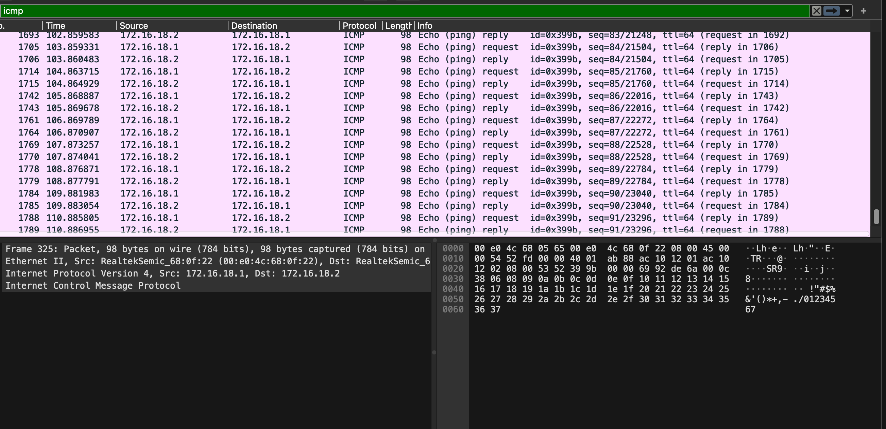
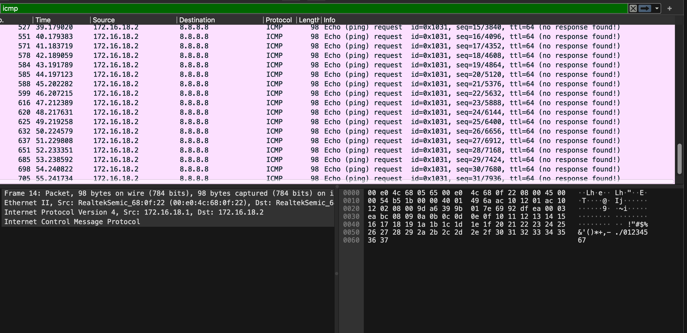
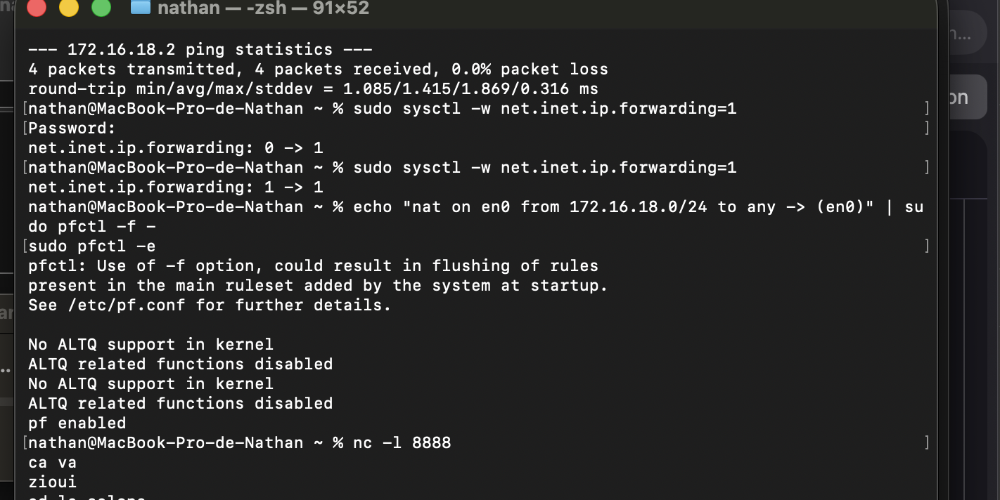
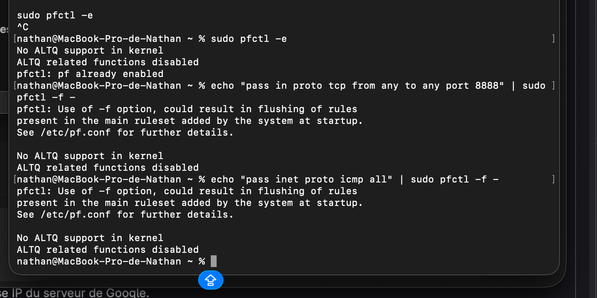

# I. Exploration locale en solo

## 1. Affichage d'informations sur la pile TCP/IP locale

---

## ▶ En ligne de commande (CLI)

### Commande utilisée

```bash
ifconfig

```

Cette commande permet d’afficher toutes les interfaces réseau et leurs paramètres IP et MAC.

---

## Interface WiFi

### Nom de l’interface

```
en0
```

### Adresse MAC

```
de:fd:b4:91:68:d8
```

### Adresse IP

```
10.33.69.207
```

### Masque de sous-réseau

Valeur affichée :

```
0xfffff000
```

Conversion :

```
255.255.240.0 (/20)
```

---

## Calcul des informations réseau WiFi

Adresse IP :

```
10.33.69.207
```

Masque :

```
255.255.240.0
```

---

### Adresse de réseau

```
10.33.64.0
```

---

### Adresse de broadcast

```
10.33.79.255
```

---

## Interface Ethernet

Les interfaces Ethernet sont inactives.

### Exemple (en1)

Nom :

```
en1
```

Adresse MAC :

```
36:a0:33:e5:f7:c0
```

Adresse IP :

```
Aucune (interface inactive)
```

Adresse réseau :

```
Non définie
```

Adresse de broadcast :

```
Non définie
```

---

## ▶ Affichage de la Gateway (Passerelle)

### Commande utilisée

```bash
route -n get default
```

---

### Gateway du réseau WiFi

```
10.33.79.254
```

---

## ▶ En interface graphique (GUI)

### Chemin sur MacOS

```
Réglages système
→ Réseau
→ Wi-Fi
→ Détails
→ TCP/IP
```

---

### Informations WiFi (GUI)

Adresse IP :

```
10.33.69.207
```

Adresse MAC :

```
de:fd:b4:91:68:d8
```

Gateway (Routeur) :

```
10.33.79.254
```

---

## Question

### À quoi sert la gateway dans le réseau d’Ingésup ?

---

La gateway (passerelle) est le routeur principal du réseau Ingésup.  
Elle permet aux ordinateurs du réseau local de communiquer avec les réseaux extérieurs, notamment Internet.

Elle permet :

- le routage des paquets hors du réseau local,
- la communication entre plusieurs réseaux,
- l’accès aux services externes (sites web, serveurs distants).

Sans gateway :

- la communication locale reste possible,
- l’accès à Internet devient impossible.

---

## Récapitulatif configuration WiFi

| Paramètre | Valeur |
---------|---------
Interface | en0
Adresse MAC | de:fd:b4:91:68:d8
Adresse IP | 10.33.69.207
Masque | 255.255.240.0 (/20)
Adresse réseau | 10.33.64.0
Broadcast | 10.33.79.255
Gateway | 10.33.79.254

---

# II. Modifications des informations réseau

---

## A. Modification d'adresse IP — Partie 1

### Calcul des adresses IP disponibles

Réseau WiFi utilisé :

```
10.33.64.0/20
```

Adresse de réseau (non utilisable) :

```
10.33.64.0
```

Adresse de broadcast (non utilisable) :

```
10.33.79.255
```

Première adresse IP disponible :

```
10.33.64.1
```

Dernière adresse IP disponible :

```
10.33.79.254
```

---

### Changement d’adresse IP via interface graphique (MacOS)

Chemin utilisé :

```
Réglages système
→ Réseau
→ Wi-Fi
→ Détails
→ TCP/IP
→ Configurer IPv4 : Manuellement
```

Nouvelle adresse IP configurée :

```
10.33.69.150
```

Masque :

```
255.255.240.0
```

Gateway :

```
10.33.79.254
```

---

### Vérification de la nouvelle configuration

Commande utilisée :

```bash
ifconfig en0
```

Résultat attendu :

```
inet 10.33.69.150
```

---

## B. Scan réseau avec Nmap

---

### Installation de Nmap

Commande utilisée :

```bash
brew install nmap
```

---

### Scan du réseau WiFi Ingésup

Commande utilisée :

```bash
nmap -sn 10.33.64.0/20
```

Cette commande permet d’afficher les hôtes actifs actuellement connectés au réseau.

---

### Sélection d’une adresse IP libre

Après analyse des adresses IP actives, une adresse IP libre a été choisie :

```
10.33.69.180
```

---

## C. Modification d'adresse IP — Partie 2

---

### Nouvelle configuration réseau

Adresse IP :

```
10.33.69.180
```

Masque :

```
255.255.240.0
```

Gateway :

```
10.33.79.254
```

---

### Test de connectivité Internet

Commande utilisée :

```bash
ping 8.8.8.8
```

Résultat :

Connexion Internet fonctionnelle, les paquets ICMP sont correctement reçus.

---


# III. Manipulations d'autres outils et protocoles côté client

---

## 1. DHCP

---

### Affichage des informations DHCP

Commande utilisée :

```bash
ipconfig getpacket en0
```

Cette commande permet d’afficher les informations DHCP reçues par la carte WiFi.

---

### Serveur DHCP du réseau Ingésup

Serveur DHCP :

```
10.33.79.254
```

---

### Bail DHCP (DHCP Lease)

Le bail DHCP correspond à la durée pendant laquelle l’adresse IP est valide.

Exemple :

```
lease_time = 35305 secondes
```

Soit :

```
environ 9 heures 48 minutes
```

---

### Fonctionnement du DHCP (résumé)

Le protocole DHCP fonctionne en 4 étapes (DORA) :

1. Discover → le client cherche un serveur DHCP
2. Offer → le serveur propose une IP
3. Request → le client accepte l’offre
4. Acknowledge → le serveur valide l’attribution

Cela permet d’attribuer automatiquement :

- une adresse IP
- un masque
- une gateway
- des DNS

---

### Renouvellement de l’adresse IP

Commande utilisée :

```bash
sudo ipconfig set en0 DHCP
```

Résultat :

Une nouvelle adresse IP est demandée automatiquement au serveur DHCP.

---

## 2. DNS

---

### Affichage du serveur DNS utilisé

Commande utilisée :

```bash
scutil --dns
```

Résultat :

Serveur DNS principal :

```
8.8.8.8
1.1.1.1
```

---

### Lookup DNS (résolution nom → IP)

---

#### Google

Commande :

```bash
dig google.com
```

Résultat :

Une ou plusieurs adresses IP sont retournées correspondant aux serveurs Google.

Cela montre que le DNS traduit un nom de domaine en adresse IP.

---

#### Ynov

Commande :

```bash
dig ynov.com
```

Résultat :

Le serveur DNS retourne l’adresse IP du site ynov.com.

---

### Reverse Lookup (IP → nom)

---

#### Adresse 78.78.21.21

Commande :

```bash
dig -x 78.78.21.21
```

Résultat :

host-78-78-21-21.mobileonline.telia.com

---

#### Adresse 92.16.54.88

Commande :

```bash
dig -x 92.16.54.88
```

Résultat :

host-92-16-54-88.as13285.net

---

## 3. Bonus — Approfondissement

---

Wireshark peut être utilisé pour observer :

- les requêtes DHCP
- les échanges DNS
- les paquets ICMP (ping)

La différence entre WiFi et Ethernet :

- Ethernet est plus stable et rapide
- WiFi est plus flexible mais sensible aux interférences

---

## Bilan du TP

---

### Outils utilisés

- ifconfig → affichage interfaces réseau
- ping → test connectivité
- nmap → scan réseau
- dig → requêtes DNS
- Wireshark → analyse trafic réseau

---

### Notions importantes

Pour qu’un ordinateur communique en réseau :

- il doit posséder une carte réseau
- une adresse MAC
- une adresse IP
- une liaison physique (WiFi ou câble)

---

### Rôles réseau importants

Gateway :

- permet l’accès Internet

DNS :

- traduit noms de domaine vers IP

DHCP :

- attribue automatiquement les paramètres réseau

---

Chez soi, la box Internet joue les rôles de :

- routeur
- serveur DHCP
- serveur DNS
- passerelle Internet

---

# IV. Exploration locale en duo (RJ45 + Gateway + Netcat + Wireshark)

---

## 1. Création d’un réseau local entre deux Macs

Connexion via câble RJ45.

Interfaces utilisées :

- Nathan : en7
- Enzo : en6

Réseau choisi :

```
172.16.18.0/24
```

Configuration Nathan :

```bash
sudo ifconfig en7 172.16.18.1 netmask 255.255.255.0 up
```

Configuration Enzo :

```bash
sudo ifconfig en6 172.16.18.2 netmask 255.255.255.0 up
```

Vérification :

```bash
ifconfig en7
ifconfig en6
```

Test connectivité :

```bash
ping 172.16.18.2
ping 172.16.18.1
```

Communication validée.

### Capture Wireshark – Ping local entre les deux machines (RJ45)



---

---

## 2. Tests avec différents masques

### /20

```
172.16.16.1/20
172.16.16.2/20
```

### /24

```
172.16.18.1/24
172.16.18.2/24
```

### /30 (plus petit réseau possible pour 2 hôtes)

```
192.168.1.1/30
192.168.1.2/30
```

---

## 3. Utilisation d’un Mac comme passerelle (Gateway)

Objectif : permettre à Enzo d’accéder à Internet via le Mac de Nathan.

### Sur le Mac de Nathan (avec WiFi actif)

Activation du routage IP :

```bash
sudo sysctl -w net.inet.ip.forwarding=1
```

Activation du NAT (WiFi = en0) :

```bash
echo "nat on en0 from 172.16.18.0/24 to any -> (en0)" | sudo pfctl -f -
sudo pfctl -e
```

---

### Sur le Mac d’Enzo (WiFi désactivé)

Désactivation du WiFi :

```bash
networksetup -setairportpower en0 off
```

Ajout de la passerelle :

```bash
sudo route add default 172.16.18.1
```

Test :

```bash
ping 8.8.8.8
```

Internet accessible via le Mac de Nathan.

### Capture Wireshark – Ping Internet via Gateway



---

---

## 4. Communication avec Netcat

Nathan (serveur) :

```bash
nc -l 8888
```

Enzo (client) :

```bash
nc 172.16.18.1 8888
```

Communication TCP bidirectionnelle validée.

### Capture – Gateway + NAT + Netcat



---

---

## 5. Analyse avec Wireshark

Interface capturée :

```
USB 10/100/1000 LAN : en7
```

Filtres utilisés :

- ICMP :
```
icmp
```

- Netcat (port 8888) :
```
tcp.port == 8888
```

- Routage :
```
ip.addr == 172.16.18.1
```

Observation des trames :

- ICMP Echo Request / Reply
- Handshake TCP (SYN, SYN-ACK, ACK)
- Paquets NAT vers Internet

---

## 6. Firewall

Activation du firewall (pf) :

```bash
sudo pfctl -e
```

Autorisation ICMP et port 8888 configurée.

### Capture – Configuration du Firewall (PF)



---

---

## Conclusion générale du TP

Ce TP a permis de :

- créer un réseau local manuellement
- configurer des adresses IP statiques
- comprendre le rôle du masque réseau
- utiliser un poste comme routeur
- mettre en place un NAT
- établir une communication TCP simple
- analyser les trames réseau avec Wireshark
- manipuler les bases d’un firewall

Le fonctionnement d’un réseau local, du routage et de la communication TCP/IP a été validé expérimentalement.

---