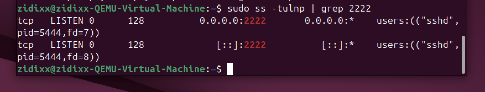
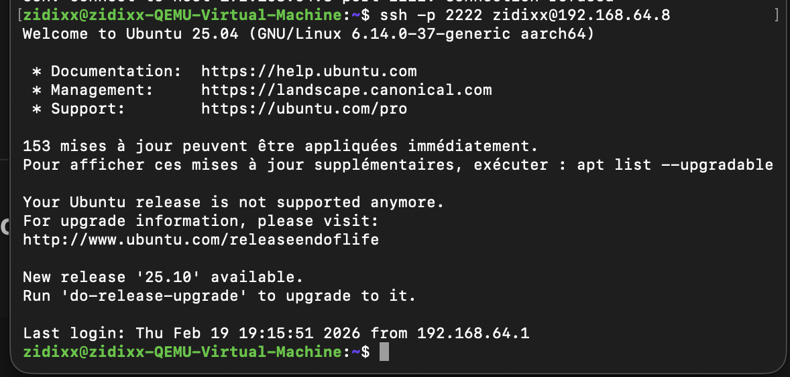
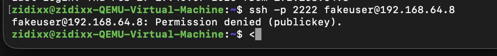
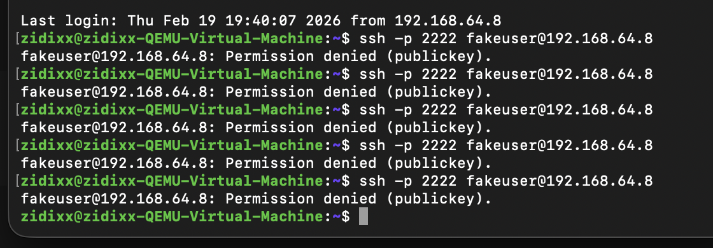
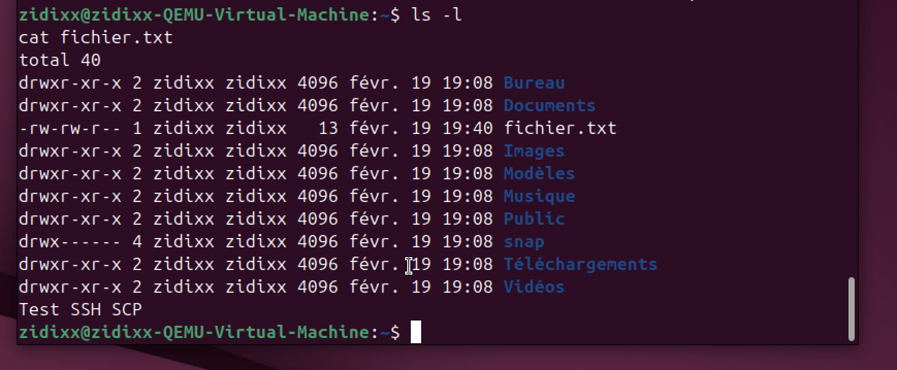
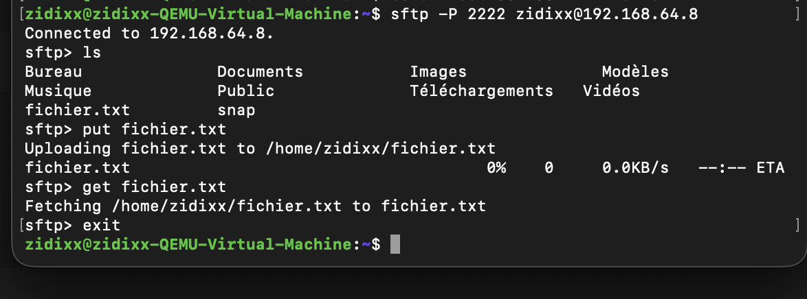
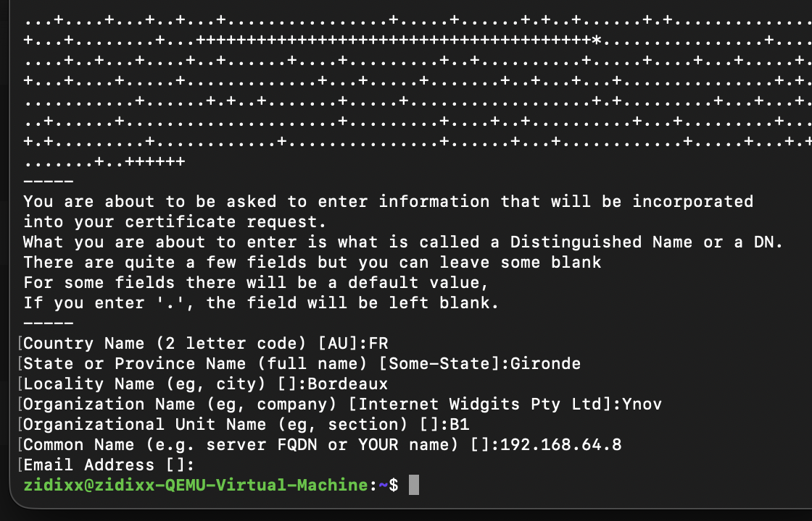
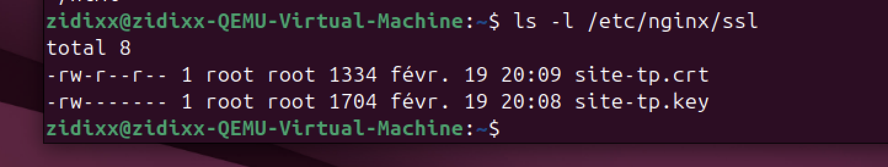
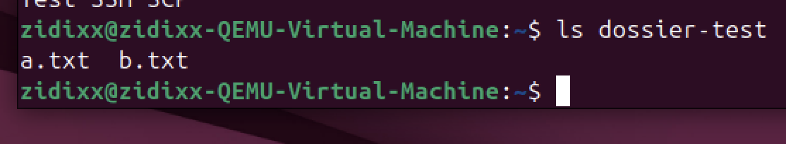

# TP – Administration SSH et Serveur Web Nginx

---

## Partie 1 – VM Ubuntu

- VM Ubuntu créée (2 Go RAM, 20 Go disque)
- Réseau : Bridged Adapter
- IP obtenue : 192.168.64.8
- Vérification : `ip a` et `ping`

---

## Partie 2 – Serveur SSH

- Installation :
```bash
sudo apt install openssh-server
```

- Vérification service :
```bash
sudo systemctl status ssh
```

- Changement port 2222 confirmé :

```bash
sudo ss -tulnp | grep 2222
```



- Connexion SSH sur port 2222 :

```bash
ssh -p 2222 zidixx@192.168.64.8
```



---

## Partie 3 – Sécurisation SSH

Dans `/etc/ssh/sshd_config` :

- `PermitRootLogin no`
- `PasswordAuthentication no`
- `Port 2222`

Refus utilisateur inexistant :

```bash
ssh -p 2222 fakeuser@192.168.64.8
```



Tentatives répétées :



---

## Partie 4 – Transfert de fichiers

### SCP

```bash
scp -P 2222 fichier.txt zidixx@192.168.64.8:/home/zidixx/
```



### SFTP

```bash
sftp -P 2222 zidixx@192.168.64.8
```

Commandes utilisées : `ls`, `put`, `get`



---

## Partie 5 – Fail2Ban

Vérification jail SSH :

```bash
sudo fail2ban-client status sshd
```

Fail2Ban actif et surveillance du service SSH.

---

## Partie 6 – Tunnel SSH

Tunnel local utilisé :

```bash
ssh -p 2222 -L 9090:localhost:80 zidixx@192.168.64.8
```

Accès au site via port local redirigé.

---

## Partie 7 – Nginx et HTTPS

Installation :

```bash
sudo apt install nginx
```

Création certificat auto-signé :

```bash
openssl req -x509 -nodes -days 365 -newkey rsa:2048
```



Fichiers SSL créés :

```bash
ls -l /etc/nginx/ssl
```



Redirection HTTP → HTTPS vérifiée :

```bash
curl -I http://localhost
curl -k https://localhost
```

---

## Partie 8 – Firewall

Activation UFW :

```bash
sudo ufw allow 'Nginx Full'
sudo ufw allow 2222/tcp
sudo ufw enable
sudo ufw status
```



Règles actives :


---

## Partie 9 – Validation finale

- SSH fonctionne sur port 2222
- Authentification par clé uniquement
- Utilisateur invalide refusé
- Fail2Ban actif
- SCP et SFTP fonctionnels
- Nginx accessible en HTTP et HTTPS
- Redirection HTTP → HTTPS active
- Certificat SSL auto-signé valide
- Firewall actif avec règles SSH + Nginx

TP validé.