# TP5 – pfSense : Bases d’un pare-feu

---

# Partie 1 – Prise en main et sécurisation

## 1. Accès à l’interface

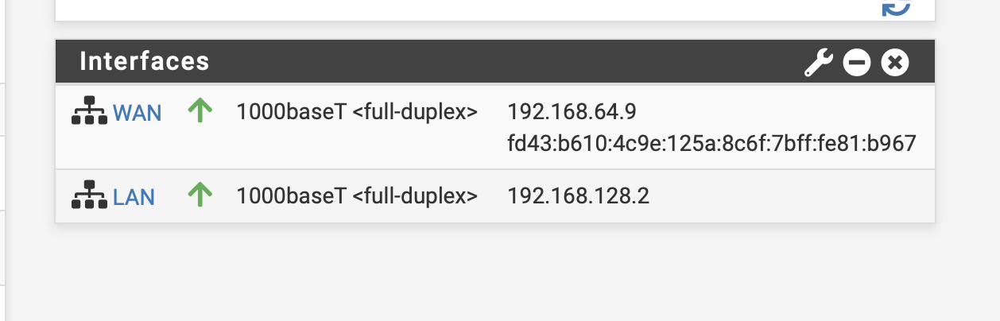

### Quelle est l’adresse IP du LAN ?
192.168.128.2/24

### Quelle est l’adresse IP du WAN ?
192.168.64.9

### Pourquoi utilise-t-on HTTPS ?
Pour chiffrer les communications d’administration et éviter l’interception des identifiants.

### Pourquoi faut-il changer les identifiants par défaut ?
Les identifiants par défaut sont connus publiquement → risque de compromission immédiate.

---

## 2. Sécurisation de l’accès administrateur

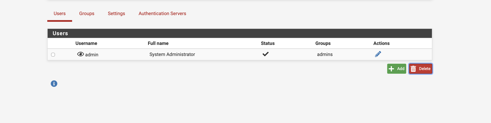

### Où se gèrent les utilisateurs ?
System → User Manager

### Qu’est-ce qu’un mot de passe robuste ?
- Long (>12 caractères)
- Majuscules / minuscules
- Chiffres
- Caractères spéciaux
- Non présent dans un dictionnaire

### Pourquoi sécuriser en priorité l’accès admin ?
Car le pare-feu contrôle tout le trafic réseau → compromission = perte totale de sécurité.

---

# Partie 2 – Interfaces réseau

## 3. Vérification des interfaces

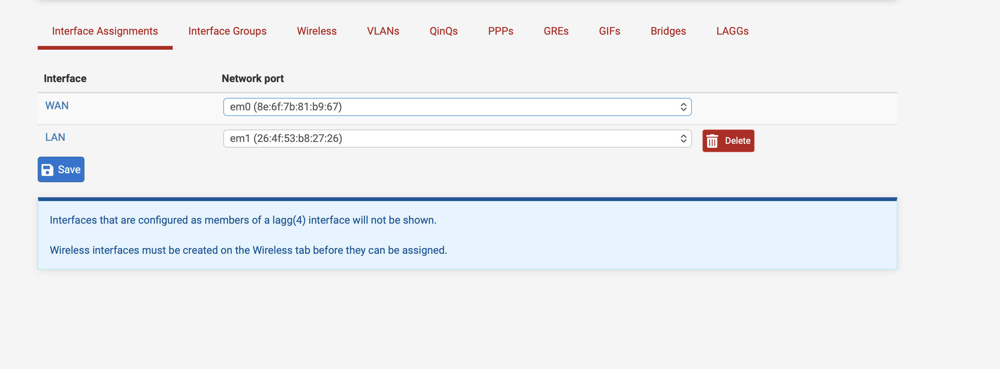  
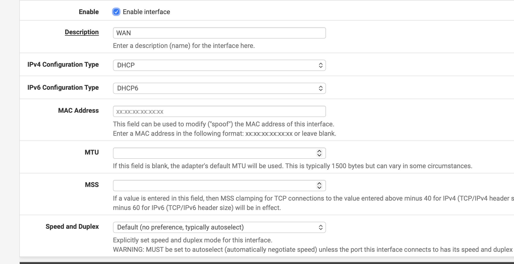  
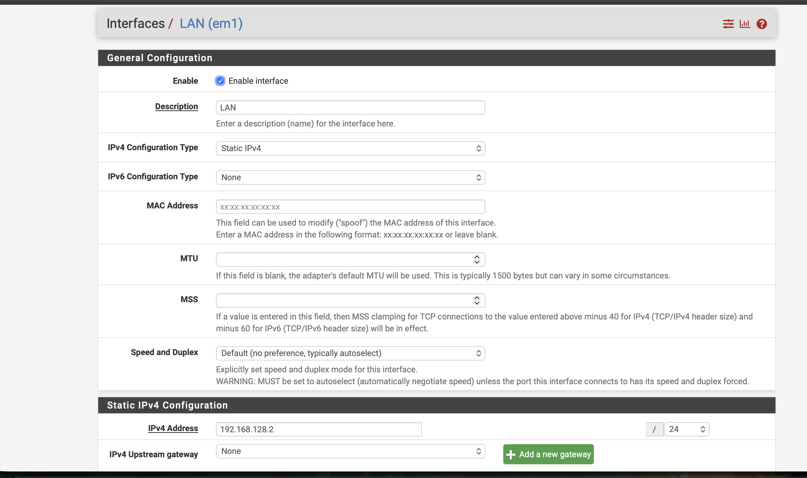

### Quelle interface permet l’accès Internet ?
WAN

### Quelle interface correspond au réseau interne ?
LAN

### Que se passerait-il si elles étaient inversées ?
Le LAN serait exposé directement à Internet → faille critique.

---

# Partie 3 – Services réseau

## 4. DHCP

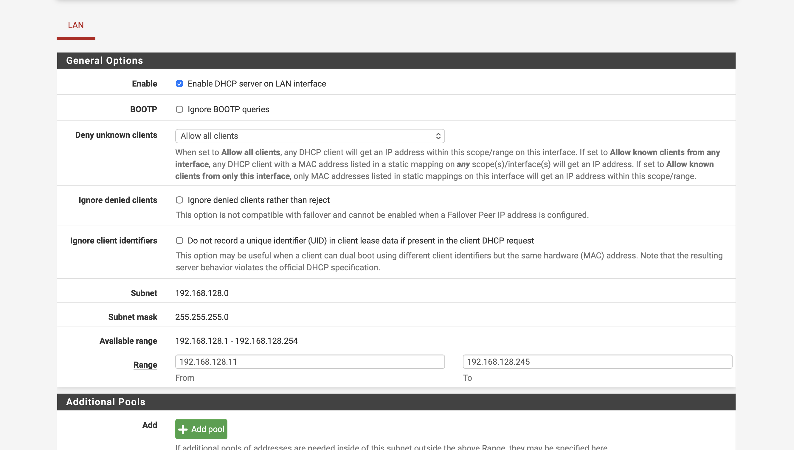

### Pourquoi utiliser DHCP ?
Distribution automatique des IP → gestion simplifiée.

### Quelle plage choisir ?
Exemple : 192.168.128.11 – 192.168.128.245

### Quelles adresses éviter ?
- IP du pare-feu (192.168.128.2)
- IP statiques (serveurs)

### Vérification Ubuntu

Commande :

```bash
ip a
```

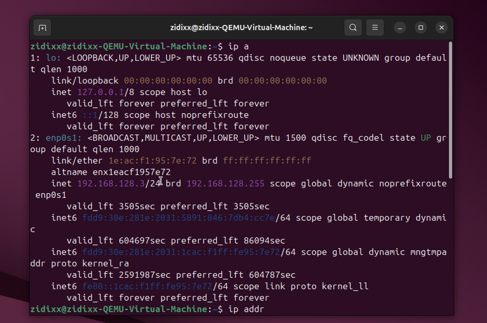

Ubuntu obtient bien automatiquement une IP.

---

## 5. DNS

### Pourquoi le pare-feu peut jouer le rôle de DNS ?
Centralisation des requêtes + contrôle + filtrage possible.

### Si DNS ne fonctionne pas mais ping 8.8.8.8 fonctionne ?
Le réseau fonctionne, mais la résolution de noms échoue.

Test :

```bash
ping 8.8.8.8
nslookup google.com
```

---

# Partie 4 – Autoriser Internet

## 6. Règles pare-feu

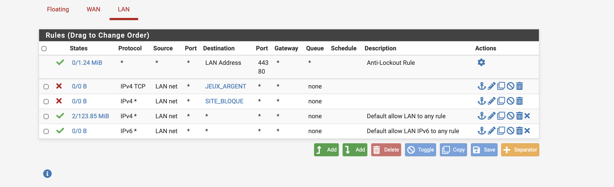

### Source ?
LAN net

### Destination ?
Any

### Autoriser tous les protocoles ?
Oui pour accès Internet général (IPv4 *)

### Tests

```bash
ping 192.168.128.2
ping 8.8.8.8
nslookup google.com
curl http://google.com
```

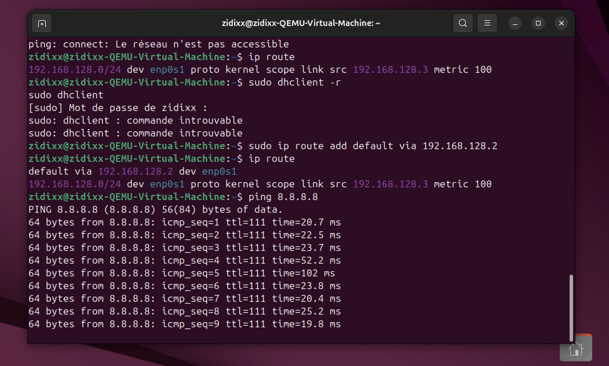

### Si ça ne fonctionne pas ?
Vérifier :
- Firewall → Rules
- Firewall → Logs
- NAT
- Gateway

---

## 7. NAT

### Pourquoi NAT est nécessaire ?
Car WAN est en réseau NAT (VirtualBox).  
Il faut traduire les IP privées vers IP WAN.

### Différence NAT automatique / manuel ?
- Automatique : pfSense crée les règles
- Manuel : configuration personnalisée

### Vérification traduction ?
Firewall → Diagnostics → States  
Ou consulter les logs.

---

# Partie 5 – Filtrage

## 8. Blocage site spécifique

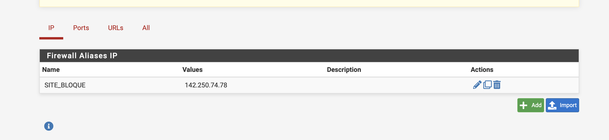  
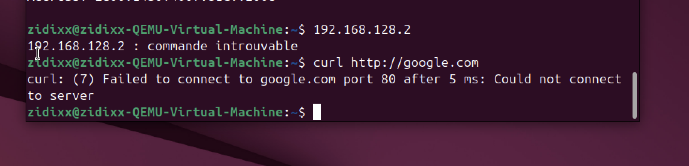

### Bloquer par IP ou domaine ?
Par IP ou via DNS Resolver.

### Si HTTPS ?
Impossible d’inspecter contenu sans inspection SSL.

### Pourquoi blocage IP contournable ?
- CDN
- Changement IP
- VPN

Logs visibles dans Firewall → Logs.

---

## 9. Blocage catégorie (jeux d’argent)

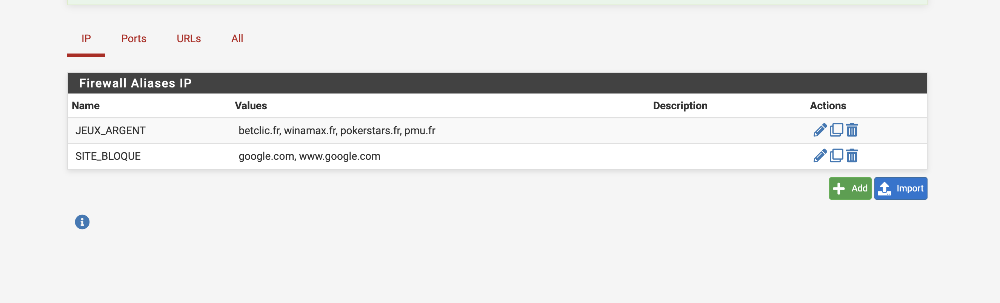

### Pourquoi pas une règle par site ?
Non maintenable → utiliser alias.

### Où créer alias ?
Firewall → Aliases

### Vérification blocage ?
Test :

```bash
curl http://betclic.fr
```

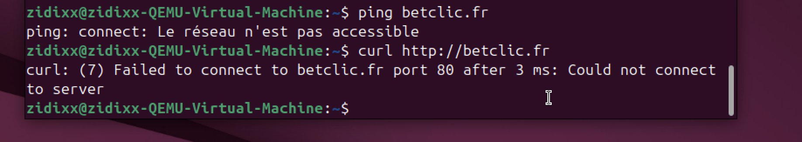

---

# Partie 6 – Aller plus loin

## 10. Blocage réseaux sociaux

Créer alias + règle.

### Si règle sous "Pass Any" ?
Elle ne sera jamais appliquée (ordre top → bottom).

---

## 11. Règles horaires

Créer schedule → appliquer à règle.

### Pourquoi utile en entreprise ?
Limiter accès selon horaires de travail.

---

## 12. Serveur web local

Installation Ubuntu :

```bash
sudo apt update
sudo apt install apache2
```

### Filtrer par IP source ?
Oui pour limiter accès.

### Filtrer par port ?
Oui (autoriser uniquement 80/443).

### Pourquoi pare-feu protège LAN ?
Car il contrôle tout trafic entrant/sortant.

---

## 13. Logs

Activer "Log packets handled".

### Différence paquet bloqué / autorisé ?
- Pass = autorisé
- Block = refusé

### Identifier règle ?
Colonne "Rule" dans logs.

### Sens trafic ?
Source → Destination.

---

## 14. DMZ

### Qu’est-ce qu’une DMZ ?
Réseau isolé pour serveurs exposés.

### Pourquoi isoler ?
Limiter impact en cas de compromission.

### Machine DMZ vers LAN ?
Non (règles restrictives).

### LAN vers DMZ ?
Oui si autorisé explicitement.

---

## 15. Filtrage MAC

### Est-ce sécurisé ?
Non.

### Pourquoi contournable ?
Adresse MAC falsifiable (spoofing).

---

## 16. Portail captif

### Contextes ?
Wi-Fi public, hôtels, entreprises.

### Avantage vs simple règle ?
Authentification + traçabilité utilisateur.

---

## 17. Sauvegarde / restauration

System → Backup & Restore

### Pourquoi sauvegarde essentielle ?
Permet restauration rapide en cas d’erreur ou panne.

---

# Conclusion

Objectifs atteints :
- Installation pfSense
- DHCP / DNS
- NAT
- Règles pare-feu
- Alias
- Filtrage ciblé
- Tests fonctionnels validés
